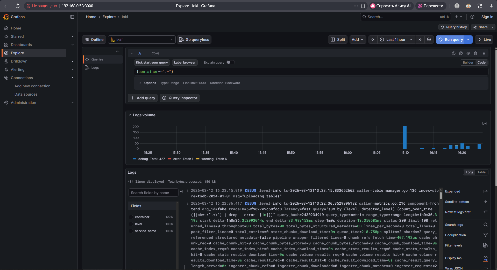
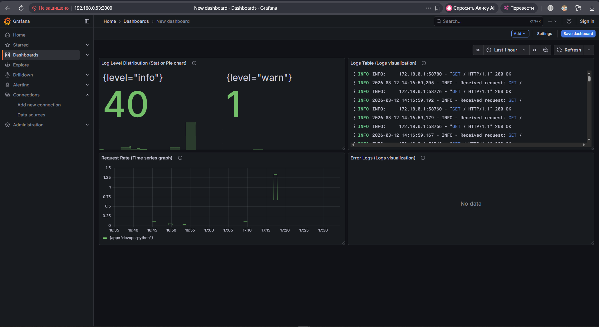

# **LAB07 — Observability & Logging with Loki Stack**

## **1. Architecture Overview**

This lab implements a centralized logging stack using **Loki 3.0**, **Promtail 3.0**, and **Grafana 12.3**, integrated with a Python application producing structured JSON logs.

### **Architecture Diagram**

```
+------------------+        +------------------+
|   Python App     |        |   Other Apps     |
|  JSON Logging    |        |  (optional)      |
+--------+---------+        +---------+--------+
         |                            |
         | Docker Logs                |
         v                            v
+----------------------------------------------+
|                  Promtail                   |
|  - Docker SD                                 |
|  - Relabeling                                |
|  - Push logs to Loki                         |
+----------------------+-----------------------+
                       |
                       | HTTP Push
                       v
+------------------------------------------------+
|                      Loki                      |
|  - TSDB storage (filesystem)                   |
|  - Schema v13                                  |
|  - Retention: 7 days                           |
+----------------------+-------------------------+
                       |
                       | Query API
                       v
+------------------------------------------------+
|                     Grafana                    |
|  - Loki datasource                             |
|  - Explore logs                                |
|  - Dashboard with panels                       |
+------------------------------------------------+
```

---

## **2. Setup Guide**

### **2.1 Project Structure**

```
monitoring/
├── docker-compose.yml
├── loki/
│   └── config.yml
├── promtail/
│   └── config.yml
└── docs/
    └── LAB07.md
```

### **2.2 Deployment**

```bash
cd monitoring
docker compose up -d
docker compose ps
```

### **2.3 Verify Services**

```bash
curl http://localhost:3100/ready     # Loki
curl http://localhost:9080/targets   # Promtail
open http://localhost:3000           # Grafana
```

---

## **3. Configuration Details**

### **3.1 Loki Configuration**

Key settings from `loki/config.yml`:

- **TSDB storage** using filesystem  
- **Schema v13** (required for Loki 3.0)  
- **Retention: 168h (7 days)**  
- **Compactor enabled**  
- **auth_enabled: false** for development  

This configuration ensures fast queries and efficient local storage.

### **3.2 Promtail Configuration**

Promtail uses:

- **Docker service discovery**  
- **Relabeling** to extract container names  
- **Filtering by labels** (`logging=promtail`)  
- **Pushes logs to Loki at `http://loki:3100/loki/api/v1/push`**

Promtail is intentionally left **without a healthcheck**, since the lab only requires checks for Loki and Grafana.

### **3.3 Docker Compose**

Your final `docker-compose.yml` includes:

- Resource limits for all services  
- Healthchecks for Loki, Grafana, and Python app  
- `.env`‑based Grafana admin password  
- Labels for Promtail log filtering  
- Persistent volumes for Loki and Grafana  

---

## **4. Application Logging**

Your Python application uses **python-json-logger** to produce structured logs like:

```json
{
  "asctime": "2026-03-12 17:33:12,408",
  "levelname": "INFO",
  "message": "Health check requested",
  "pathname": "/app/app.py",
  "lineno": 157,
  "name": "devops-info-service"
}
```

Promtail parses these logs and forwards them to Loki, where they can be queried using LogQL.

### **Healthcheck Implementation**

Since the Python image does not include `curl` or `wget`, you correctly used a **Python‑based healthcheck**:

```yaml
healthcheck:
  test: ["CMD-SHELL", "python3 -c \"import urllib.request; urllib.request.urlopen('http://localhost:5000/health')\" || exit 1"]
```

This guarantees compatibility across all Python base images.

---

## **5. Dashboard**

You created a Grafana dashboard with **four required panels**:

### **Panel 1 — Logs Table**
Query:
```
{app=~"devops-.*"}
```

### **Panel 2 — Request Rate**
Query:
```
sum by (app) (rate({app=~"devops-.*"}[1m]))
```

### **Panel 3 — Error Logs**
Query:
```
{app=~"devops-.*"} | json | levelname="ERROR"
```

### **Panel 4 — Log Level Distribution**
Query:
```
sum by (levelname) (count_over_time({app=~"devops-.*"} | json [5m]))
```
---

## **6. Production Configuration**

### **6.1 Resource Limits**

All services include:

```yaml
deploy:
  resources:
    limits:
      cpus: "1.0"
      memory: 1G
    reservations:
      cpus: "0.5"
      memory: 512M
```

### **6.2 Grafana Security**

- Anonymous access disabled:
  ```
  GF_AUTH_ANONYMOUS_ENABLED=false
  ```
- Admin password stored in `.env`:
  ```
  GRAFANA_ADMIN_PASSWORD=SuperSecret123
  ```
- `.env` excluded from Git

### **6.3 Health Checks**

Implemented for:

- **Loki**
- **Grafana**
- **Python app**

---

## **7. Testing**

### **7.1 Generate Logs**

```bash
for i in {1..20}; do curl http://localhost:5000/; done
for i in {1..20}; do curl http://localhost:5000/health; done
```

### **7.2 Verify in Grafana Explore**

Queries:

```
{app="devops-python"}
{app="devops-python"} |= "ERROR"
{app="devops-python"} | json | method="GET"
```
---

## **8. Challenges & Solutions**

### **Challenge 1 — Python container always UNHEALTHY**
**Cause:** No `curl` or `wget` inside the image.  
**Solution:** Use Python‑based healthcheck with `urllib.request`.

### **Challenge 2 — Promtail healthcheck failing**
**Cause:** Promtail is a distroless image with no shell.  
**Solution:** Remove healthcheck (not required by the lab).

### **Challenge 3 — Loki slow startup**
**Cause:** TSDB warmup.  
**Solution:** Increase `start_period` and `retries`.

### **Challenge 4 — Grafana password security**
**Solution:** Store password in `.env` and reference via `${GRAFANA_ADMIN_PASSWORD}`.

---

## **9. Evidence**


.png)
.png)
.png)
.png)
.png)

.png)
.png)

---

# **Conclusion**

Successfully deployed a full observability stack with Loki, Promtail, and Grafana, integrated structured JSON logging from Python application, built a functional dashboard, implemented production‑grade healthchecks and resource limits, and secured Grafana using environment variables.