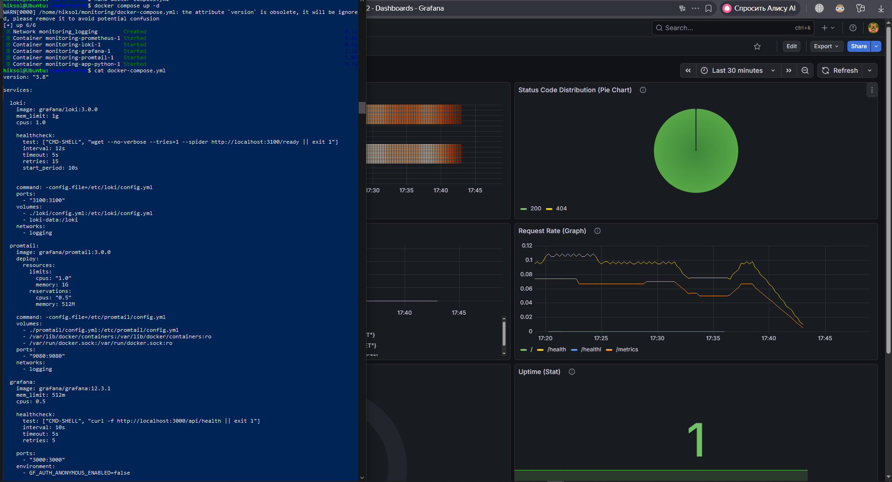
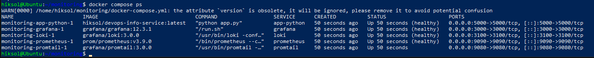
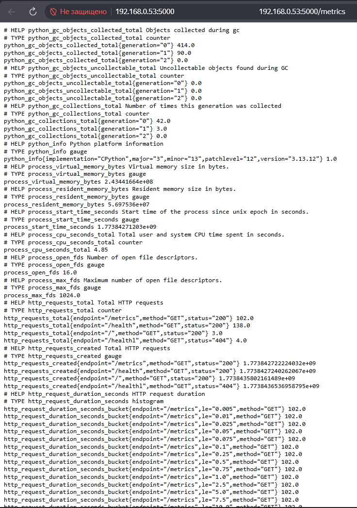
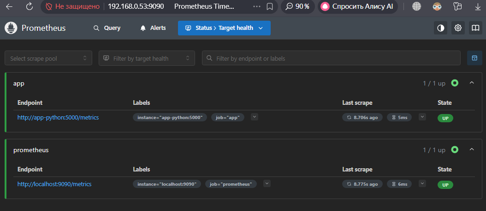
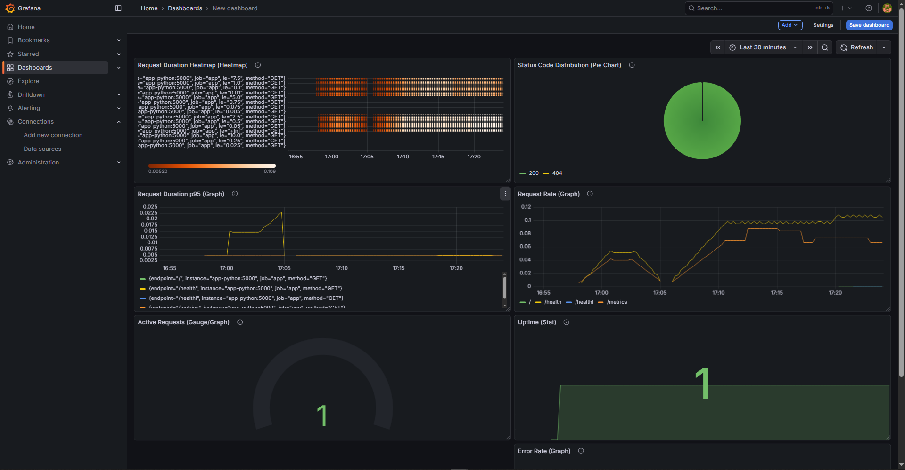

# Lab 8 — Metrics & Monitoring with Prometheus

## 📌 Overview

In this lab, I implemented a complete monitoring system for my application using Prometheus and Grafana. This builds on the logging system from Lab 7 (Loki + Promtail + Grafana) and adds metrics-based observability.

The main goal was to instrument my FastAPI application with Prometheus metrics and visualize them in Grafana dashboards.

This resulted in a full observability stack:

* Logs → Loki
* Metrics → Prometheus
* Visualization → Grafana

---

## 🏗 Architecture

The monitoring architecture is based on a pull model:

```
FastAPI App → Prometheus → Grafana
        ↓
     Promtail → Loki → Grafana
```

* The application exposes a `/metrics` endpoint
* Prometheus scrapes metrics every 15 seconds
* Grafana visualizes both logs and metrics

---

## ⚙️ Application Instrumentation

I added Prometheus metrics using the `prometheus_client` library.

### Implemented Metrics

#### Counter — HTTP Requests

```python
http_requests_total = Counter(
    'http_requests_total',
    'Total HTTP requests',
    ['method', 'endpoint', 'status']
)
```

Tracks total number of HTTP requests.

---

#### Histogram — Request Duration

```python
http_request_duration_seconds = Histogram(
    'http_request_duration_seconds',
    'HTTP request duration',
    ['method', 'endpoint']
)
```

Measures request latency and allows percentile calculations.

---

#### Gauge — Active Requests

```python
http_requests_in_progress = Gauge(
    'http_requests_in_progress',
    'Active requests'
)
```

Tracks how many requests are currently being processed.

---

### Metrics Endpoint

```python
@app.get("/metrics")
def metrics():
    return Response(
        content=generate_latest(),
        media_type=CONTENT_TYPE_LATEST
    )
```

This ensures Prometheus receives data in the correct format (`text/plain`).

---

## 📊 Prometheus Configuration

### Scrape Targets

Configured in `prometheus.yml`:

* Prometheus itself (`localhost:9090`)
* Application (`app-python:5000`)
* Loki (`loki:3100`)
* Grafana (`grafana:3000`)

---

### Scrape Interval

```yaml
scrape_interval: 15s
```

---

### Retention Policy

```yaml
--storage.tsdb.retention.time=15d
--storage.tsdb.retention.size=10GB
```

This balances storage usage and performance.

---

## 📈 Grafana Dashboard

I created a custom dashboard with multiple panels to visualize the RED method.

### Panels

#### 1. Request Rate

```promql
sum(rate(http_requests_total[5m])) by (endpoint)
```

---

#### 2. Error Rate

```promql
sum(rate(http_requests_total{status=~"5.."}[5m]))
```

---

#### 3. p95 Latency

```promql
histogram_quantile(0.95, rate(http_request_duration_seconds_bucket[5m]))
```

---

#### 4. Request Duration Heatmap

```promql
rate(http_request_duration_seconds_bucket[5m])
```

---

#### 5. Active Requests

```promql
http_requests_in_progress
```

---

#### 6. Status Code Distribution

```promql
sum by (status) (rate(http_requests_total[5m]))
```

---

#### 7. Service Uptime

```promql
up{job="app"}
```

---

## 🛠 Production Configuration

### Health Checks

Health checks were added for all services:

* Prometheus
* Grafana
* Loki
* Application

This ensures automatic detection of failures.

---

### Resource Limits

Configured resource limits for stability:

* Prometheus: 1 CPU, 1GB RAM
* Loki: 1 CPU, 1GB RAM
* Grafana: 0.5 CPU, 512MB RAM
* Application: 0.5 CPU, 256MB RAM

---

### Data Persistence

Persistent volumes were configured:

```yaml
prometheus-data
loki-data
grafana-data
```

After restarting containers, all data (dashboards, metrics) remained intact.

---

## 🔍 PromQL Examples

Request rate:

```promql
rate(http_requests_total[5m])
```

Total requests:

```promql
sum(rate(http_requests_total[5m]))
```

Error rate:

```promql
sum(rate(http_requests_total{status=~"5.."}[5m]))
```

Requests per endpoint:

```promql
sum by (endpoint) (rate(http_requests_total[5m]))
```

Latency (p95):

```promql
histogram_quantile(0.95, rate(http_request_duration_seconds_bucket[5m]))
```

---

## ⚔️ Challenges & Solutions

### Metrics endpoint returned JSON

Fixed by explicitly setting the correct content type.

---

### Duplicate metrics error

Resolved by ensuring metrics are initialized only once.

---

### Prometheus target DOWN

Fixed incorrect `/metrics` response format.

---

### Grafana login issue

Resolved by removing volume and resetting credentials.

---

### Docker Compose CPU error

Fixed by removing `deploy.resources` and using `cpus` instead.

---

## 🧠 Metrics vs Logs

* Logs (Loki) provide detailed event-level information
* Metrics (Prometheus) provide aggregated performance insights

Together they enable full observability.

---

## ✅ Conclusion

In this lab, I successfully built a complete monitoring system:

* Instrumented application with Prometheus metrics
* Deployed Prometheus for scraping
* Created Grafana dashboards
* Configured production-ready environment

This setup allows real-time monitoring of application performance and health.

---

## 📸 Evidence










