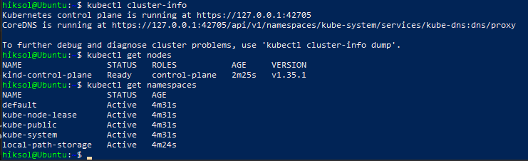
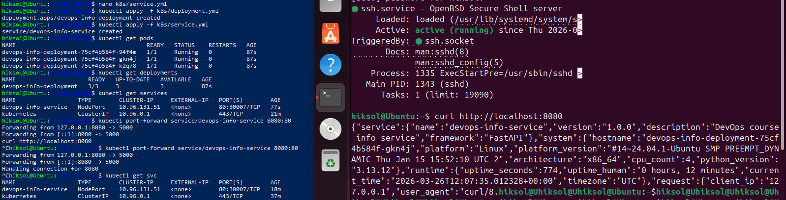
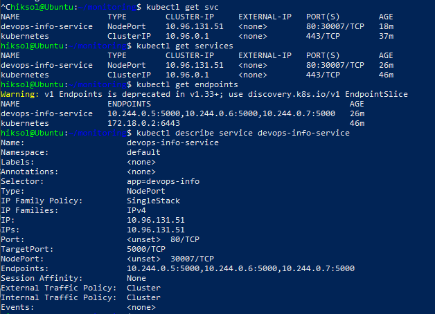
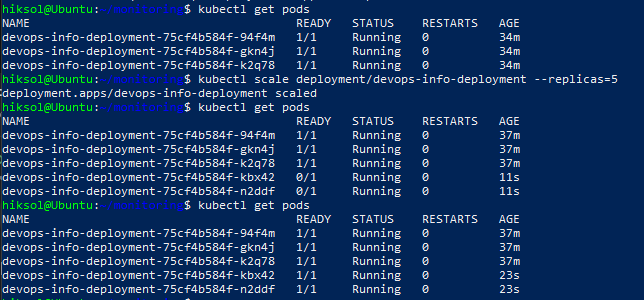
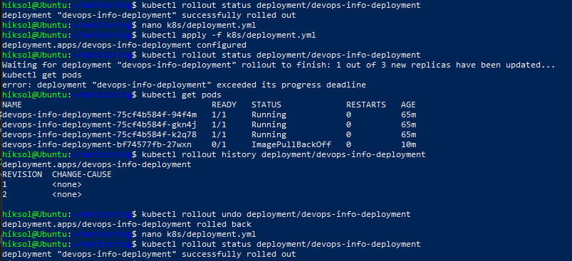

# Lab 9

## 1. Architecture Overview

In this lab, I deployed my Python application to Kubernetes using declarative manifests.

System architecture:

- **Deployment** — manages Pods and their replication
- **Pods** — containers running the application
- **Service (NodePort)** — provides external access to the application

Data flow:
Client → Service → Pods

Initial state: 3 replicas, later scaled to 5.

Resource model:
- CPU: 100m (request) / 200m (limit)
- Memory: 128Mi (request) / 256Mi (limit)

---

## 2. Manifest Files

### deployment.yml

The Deployment includes:
- 3 replicas (later scaled to 5)
- a container with the Python application
- port 5000
- livenessProbe and readinessProbe
- resource limits

Reasons for these choices:
- Replication improves fault tolerance
- Health checks ensure self‑healing
- Resource limits prevent node overload

---

### service.yml

Type: NodePort

Purpose:
- provide external access to the application
- load balance traffic across Pods

---

## 3. Deployment Evidence

Commands used:

```bash
kubectl get all
kubectl get pods,svc
kubectl describe deployment devops-info-deployment
```

Results:

* Pods successfully started
* Service accessible via NodePort
* Application responds to HTTP requests

---

## 4. Operations Performed

### Application Deployment

```bash
kubectl apply -f k8s/deployment.yml
kubectl apply -f k8s/service.yml
```

---

### Scaling

```bash
kubectl scale deployment/devops-info-deployment --replicas=5
```

Verification:

```bash
kubectl get pods
```

Result:

* 5 Pods successfully running

---

### Rolling Update

I updated the container image:

```yaml
image: hiksol/devops-info-service:v2
```

Then applied the update:

```bash
kubectl apply -f k8s/deployment.yml
kubectl rollout status deployment/devops-info-deployment
```

---

### Update Error

During the rolling update, an error occurred:

```
ImagePullBackOff
```

Cause:

* the image `hiksol/devops-info-service:v2` does not exist in Docker Hub

Diagnostics:

```bash
kubectl describe pod <pod-name>
```

Output showed:

```
failed to pull image: not found
```

---

### Rollback

To restore system functionality, I performed a rollback:

```bash
kubectl rollout undo deployment/devops-info-deployment
```

Verification:

```bash
kubectl rollout status deployment/devops-info-deployment
```

Result:

* Deployment successfully restored
* all Pods returned to Running state

---

### Accessing the Service

```bash
minikube service devops-info-service
```

or:

```bash
kubectl port-forward service/devops-info-service 8080:80
```

---

## 5. Production Considerations

### Health Checks

Configured:

* livenessProbe — restarts the container on failure
* readinessProbe — ensures the Pod is ready before receiving traffic

Why:
ensures automatic recovery and prevents downtime

---

### Resource Limits

Set to:

* prevent node overload
* ensure stable cluster operation

---

### Possible Improvements

* Horizontal Pod Autoscaler (HPA)
* Ingress instead of NodePort
* CI/CD pipeline
* Canary deployments

---

### Monitoring Strategy

Using the stack from the previous lab:

* Prometheus — metrics collection
* Grafana — visualization
* Loki — logging

---

## 6. Challenges & Solutions

### Issue: ImagePullBackOff

Cause:
incorrect Docker image tag

Solution:

* diagnose using `kubectl describe pod`
* rollback the deployment

---

### Issue: Incorrect Deployment Name

Solution:

```bash
kubectl get deployments
```

---

### Issue: Rollout Stuck

Cause:
new Pods not reaching Ready state

Solution:
analyze logs and Kubernetes events

---

## Conclusions

* Kubernetes maintains the desired state automatically
* Deployment manages the Pod lifecycle
* Rolling updates enable zero‑downtime application updates
* Rollback allows quick recovery from failed updates

---

## Final Summary

During this lab, I:

* deployed an application to Kubernetes
* configured Deployment and Service
* performed scaling
* executed a rolling update
* handled an update failure and performed a rollback
* explored core Kubernetes concepts

---

## Evidence









