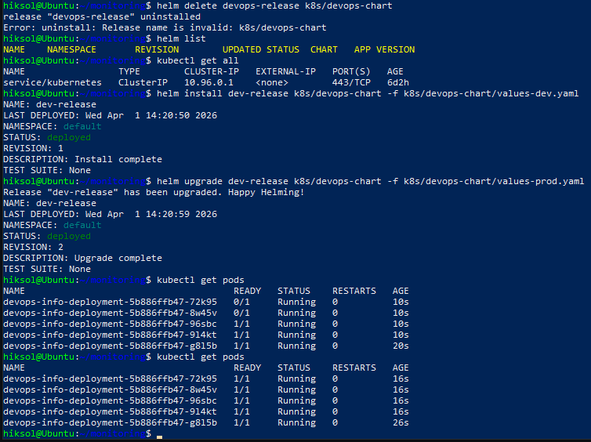
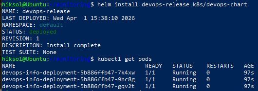
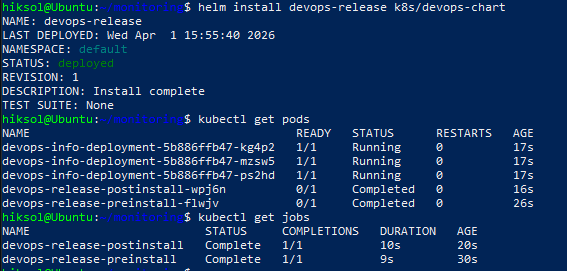
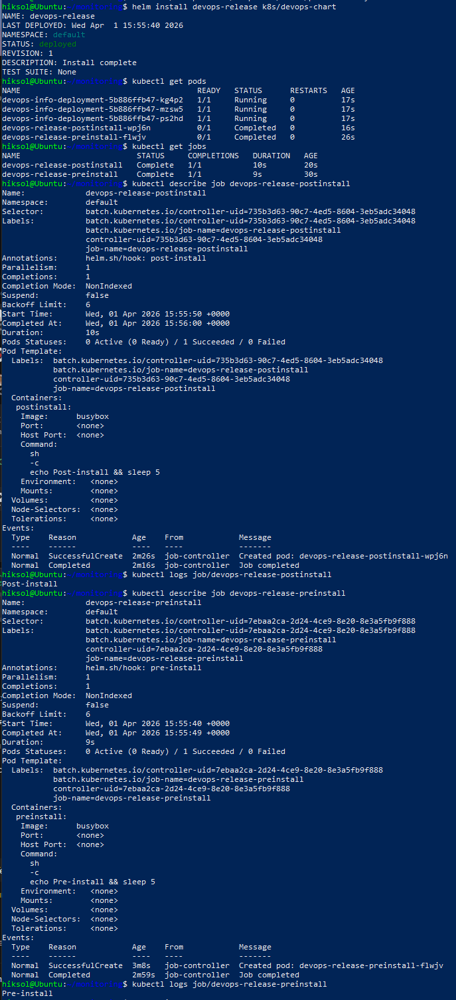

# Lab 10 — Helm Package Manager

## 1. Chart Overview

In this lab, a Helm chart was created for the `devops-info-service` application previously deployed in Kubernetes (Lab 9).

### Chart Structure

```
k8s/devops-chart/
├── Chart.yaml
├── values.yaml
├── values-dev.yaml
├── values-prod.yaml
├── templates/
│   ├── deployment.yaml
│   ├── service.yaml
│   └── hooks/
│       ├── pre-install.yaml
│       └── post-install.yaml
```

### Components Description

* **deployment.yaml** — Defines a Deployment with configurable replicas, resources, and health checks
* **service.yaml** — Exposes the application using NodePort
* **values.yaml** — Default configuration values
* **values-dev.yaml / values-prod.yaml** — Environment-specific configurations
* **hooks/** — Lifecycle hooks for pre-install and post-install actions

---

## 2. Configuration Guide

### Default Values (values.yaml)

```yaml
replicaCount: 3

image:
  repository: hiksol/devops-info-service
  tag: latest

service:
  type: NodePort
  port: 80
  targetPort: 5000
  nodePort: 30007

resources:
  limits:
    cpu: 200m
    memory: 256Mi
  requests:
    cpu: 100m
    memory: 128Mi
```

### Installation Commands

```bash
helm install devops-release k8s/devops-chart
```

### Reinstallation

```bash
helm uninstall devops-release
helm install devops-release k8s/devops-chart
```

---

## 3. Multi-Environment Support

To support different environments, two additional values files were created.

### Development Environment

```yaml
replicaCount: 1

image:
  tag: latest

resources:
  limits:
    cpu: 100m
    memory: 128Mi
  requests:
    cpu: 50m
    memory: 64Mi

service:
  type: NodePort
```

### Production Environment

```yaml
replicaCount: 5

image:
  tag: "1.0.0"

resources:
  limits:
    cpu: 500m
    memory: 512Mi
  requests:
    cpu: 200m
    memory: 256Mi

service:
  type: NodePort
```

### Deployment Commands

```bash
helm install dev-release k8s/devops-chart -f k8s/devops-chart/values-dev.yaml
```

```bash
helm install prod-release k8s/devops-chart -f k8s/devops-chart/values-prod.yaml
```

This demonstrates how the same chart can be reused with different configurations.

---

## 4. Hook Implementation

Two Helm hooks were implemented.

### Pre-install Hook

```yaml
"helm.sh/hook": pre-install
"helm.sh/hook-weight": "-5"
```

Purpose:

* Runs before deployment
* Simulates preparation step

---

### Post-install Hook

```yaml
"helm.sh/hook": post-install
"helm.sh/hook-weight": "5"
```

Purpose:

* Runs after deployment
* Simulates smoke testing

---

### Important Note

Initially, the following policy was used:

```yaml
"helm.sh/hook-delete-policy": hook-succeeded
```

This caused Jobs to be deleted immediately after execution.
For debugging purposes, this policy was temporarily removed to verify execution.

---

## 5. Installation Evidence

### Helm Installation and Repository Update

```bash
helm repo update
```

---

### Searching Charts

```bash
helm search repo prometheus
```

---

### Chart Information

```bash
helm show chart prometheus-community/prometheus
```

---

### Installing the Application

```bash
helm install devops-release k8s/devops-chart
```

Output:

```
STATUS: deployed
REVISION: 1
```

---

### Checking Resources

```bash
kubectl get pods
```

Result:

```
devops-info-deployment-xxxxx   Running
devops-info-deployment-xxxxx   Running
devops-info-deployment-xxxxx   Running
```

---

## 6. Operations

### Install

```bash
helm install devops-release k8s/devops-chart
```

### Upgrade

```bash
helm upgrade devops-release k8s/devops-chart
```

### Rollback

```bash
helm rollback devops-release 1
```

### Uninstall

```bash
helm uninstall devops-release
```

---

## 7. Testing & Validation

### Linting

```bash
helm lint k8s/devops-chart
```

Result:

```
1 chart(s) linted, 0 chart(s) failed
```

---

### Template Rendering

```bash
helm template test k8s/devops-chart
```

This confirmed correct Kubernetes manifests generation.

---

### Dry Run

```bash
helm install --dry-run --debug test-release k8s/devops-chart
```

Allowed validation of templates and hooks without actual deployment.

---

### Application Testing

```bash
curl http://<node-ip>:30007
```

The application responded successfully.

---

## 8. Conclusion

In this lab:

* Helm was used to package Kubernetes manifests
* Templates were created for Deployment and Service
* Configuration was externalized using values files
* Multi-environment support was implemented
* Lifecycle hooks were added and tested

Helm significantly improves deployment consistency, reusability, and maintainability.

---

## 9. Evidence

### Logs

See file:

* **Lab10 - Evidence Task1 - logs.txt**

---

### Screenshots









---
