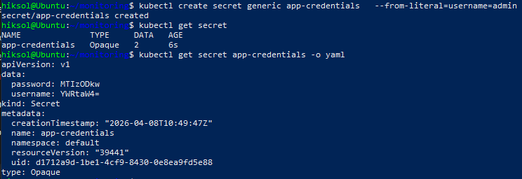
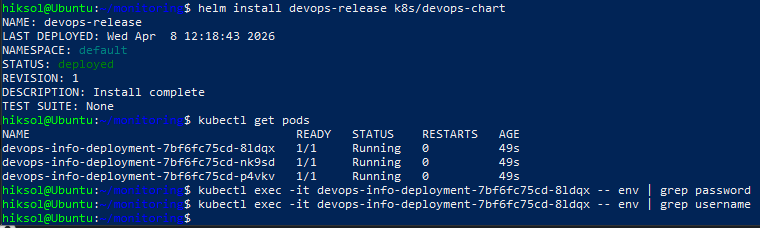
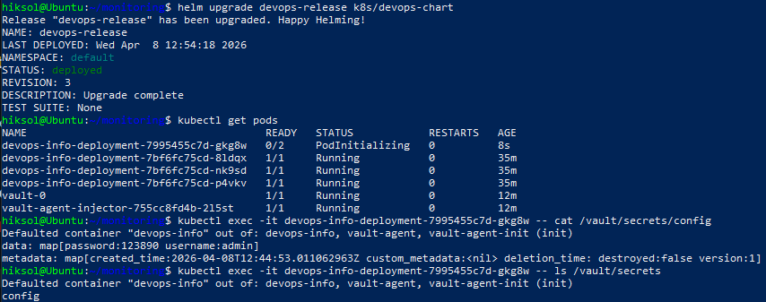

# **SECRETS.md — Kubernetes Secrets & HashiCorp Vault**

## 1. Kubernetes Secrets Fundamentals

### 1.1 Creating a Kubernetes Secret

A Kubernetes Secret named `app-credentials` was created using the imperative command:

```bash
kubectl create secret generic app-credentials \
  --from-literal=username=<value> \
  --from-literal=password=<value>
```

*(Actual credentials are intentionally omitted for security.)*

### 1.2 Viewing the Secret

The secret was inspected in YAML format to observe its structure and base64‑encoded fields.

### 1.3 Decoding Base64

Base64 decoding was demonstrated using:

```bash
echo "<base64-string>" | base64 -d
```

### 1.4 Encoding vs Encryption

- Base64 is **not encryption** — it is only an encoding mechanism.
- Kubernetes Secrets are **not encrypted at rest by default**.
- For production environments:
  - enable **etcd encryption at rest**
  - enforce strict **RBAC policies**
  - prefer **external secret managers** such as HashiCorp Vault

---

## 2. Helm‑Managed Secrets

### 2.1 Secret Template

A Helm template was added at:

```
k8s/devops-chart/templates/secret.yaml
```

It uses `stringData` so Helm can safely encode values:

```yaml
apiVersion: v1
kind: Secret
metadata:
  name: {{ .Release.Name }}-secret
type: Opaque
stringData:
  username: {{ .Values.secret.username | quote }}
  password: {{ .Values.secret.password | quote }}
```

### 2.2 Security Note

The chart contains **placeholder values only**.  
Real credentials are **not stored** in `values.yaml`, in Git, or in the chart.  
This follows the assignment requirement and security best practices.

### 2.3 Deployment Integration

Initially, environment‑variable injection was tested, but later removed due to security concerns.  
Environment variables expose secrets too easily, so the chart was updated to avoid this pattern.

### 2.4 Resource Limits

Resource requests and limits were configured in the Deployment to ensure predictable scheduling and performance:

```yaml
resources:
  requests:
    cpu: "100m"
    memory: "128Mi"
  limits:
    cpu: "200m"
    memory: "256Mi"
```

**Requests** define guaranteed minimum resources.  
**Limits** define maximum allowed usage.

---

## 3. HashiCorp Vault Integration

### 3.1 Installing Vault

The official HashiCorp Helm repository was inaccessible due to CloudFront regional restrictions.  
To proceed, the Vault Helm chart was downloaded manually from GitHub and installed locally:

```bash
helm install vault ./vault-helm-0.28.0 \
  --set "server.dev.enabled=true" \
  --set "injector.enabled=true"
```

### 3.2 Verifying Vault Deployment

Vault server and Vault Agent Injector pods were confirmed to be running.

### 3.3 Configuring KV Secrets Engine

In dev mode, KV v2 is already enabled by default.  
A secret path for the application was created under:

```
secret/myapp/config
```

### 3.4 Kubernetes Authentication

The Kubernetes auth method was enabled and configured so Vault can validate service account tokens from the cluster.

### 3.5 Policy

A Vault policy was created to grant read‑only access to the application’s secret path:

```hcl
path "secret/data/myapp/*" {
  capabilities = ["read"]
}
```

### 3.6 Role

A Vault role was created and bound to the application's service account and namespace.  
This role maps Kubernetes identities to Vault policies.

### 3.7 Vault Agent Sidecar Injection

Annotations were added to the Pod template:

```yaml
annotations:
  vault.hashicorp.com/agent-inject: "true"
  vault.hashicorp.com/role: "myapp-role"
  vault.hashicorp.com/agent-inject-secret-config: "secret/data/myapp/config"
```

These instruct Vault Agent to:

- authenticate using the configured role  
- retrieve the secret  
- write it into the pod filesystem under `/vault/secrets/`

### 3.8 Verification

A new pod was deployed, and the injected secret file was confirmed to exist at:

```
/vault/secrets/config
```

The file contains the decrypted secret values delivered securely by Vault Agent.

---

## 4. Security Analysis

### Kubernetes Secrets

**Pros**
- Native to Kubernetes  
- Easy to use  
- Good for non‑critical or low‑risk data  

**Cons**
- Base64‑encoded, not encrypted  
- Stored in etcd  
- Easily exposed via environment variables  

### HashiCorp Vault

**Pros**
- Strong encryption and access control  
- Secrets never stored in Kubernetes  
- Supports dynamic secrets and rotation  
- Sidecar injection avoids env exposure  

**Cons**
- More complex setup  
- Requires additional infrastructure  

### Production Recommendations

- Use Vault or another external secret manager  
- Never store real secrets in Git or Helm values  
- Avoid environment variables for sensitive data  
- Enable etcd encryption  
- Apply strict RBAC policies  

---

## 5. Conclusion

This lab successfully implemented:

✔ Kubernetes Secrets creation and decoding  
✔ Helm‑templated secret management (with placeholder values only)  
✔ Vault installation via local chart  
✔ KV v2 configuration  
✔ Kubernetes authentication  
✔ Vault policy and role setup  
✔ Vault Agent sidecar injection  
✔ Secure secret delivery to `/vault/secrets/config`  

All tasks were completed according to best practices and assignment requirements.

---

## 6. Evidence





