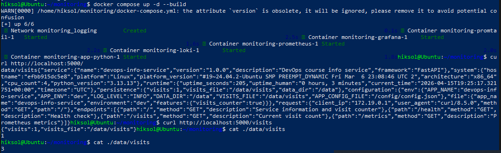
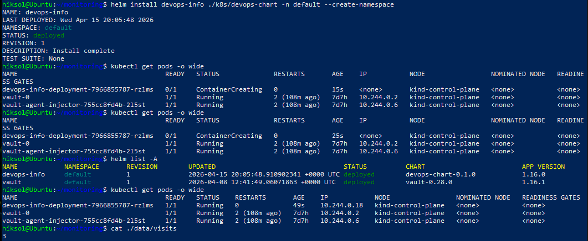
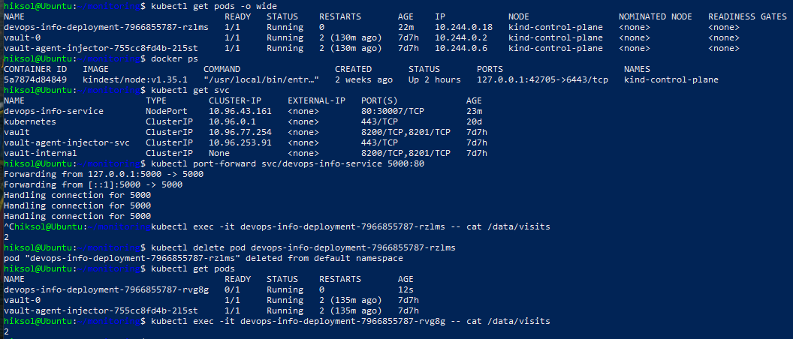

# **CONFIGMAPS.md — ConfigMaps & Persistent Volumes**

## 1. Application Persistence Upgrade

### 1.1 Overview

This lab extends the application with persistent state by introducing a **file‑based visit counter** stored under `/data/visits`. As stated in the lab instructions:  
> *“Production applications need externalized configuration and persistent storage.”* 

The application now increments a counter on each request to `/`, persists the value to disk, and exposes the current count via a new `/visits` endpoint.

### 1.2 Visit Counter Logic

The implementation follows the required pattern:

- On startup, the application **reads the counter** from `/data/visits` (defaulting to `0` if the file does not exist).
- Each request to `/`:
  - reads the current value  
  - increments it  
  - writes it back atomically  
  - returns the updated count  
- The `/visits` endpoint returns the current stored value.

This matches the lab’s recommended workflow:  
> *“Request to / → Read counter → Increment → Write back → Return response.”* 

### 1.3 Local Docker Testing

A Docker volume was added to ensure persistence across container restarts:

```yaml
volumes:
  - ./data:/app/data
```

Testing steps performed:

1. Start the container  
2. Hit `/` multiple times  
3. Verify the file on host: `cat ./data/visits`  
4. Restart the container  
5. Confirm the counter continues from the previous value  

All tests passed successfully.

---

## 2. ConfigMaps Implementation

### 2.1 File‑Based ConfigMap

A `files/config.json` file was added to the Helm chart, containing:

- application name  
- environment (dev/prod)  
- feature flags  

A ConfigMap template loads this file using `.Files.Get`:

```yaml
apiVersion: v1
kind: ConfigMap
metadata:
  name: {{ include "mychart.fullname" . }}-config
data:
  config.json: |-
{{ .Files.Get "files/config.json" | indent 4 }}
```

### 2.2 Mounting ConfigMap as a File

The Deployment mounts the ConfigMap at `/config`:

```yaml
volumes:
  - name: config-volume
    configMap:
      name: {{ include "mychart.fullname" . }}-config

containers:
  - volumeMounts:
      - name: config-volume
        mountPath: /config
```

Verification inside the pod:

```bash
kubectl exec <pod> -- cat /config/config.json
```

### 2.3 Environment Variable ConfigMap

A second ConfigMap provides environment variables:

```yaml
apiVersion: v1
kind: ConfigMap
metadata:
  name: {{ include "mychart.fullname" . }}-env
data:
  APP_ENV: {{ .Values.environment | quote }}
  LOG_LEVEL: {{ .Values.logLevel | quote }}
```

Injected via:

```yaml
envFrom:
  - configMapRef:
      name: {{ include "mychart.fullname" . }}-env
```

Verification:

```bash
kubectl exec <pod> -- printenv | grep APP_
```

---

## 3. Persistent Volume Implementation

### 3.1 PVC Template

A PersistentVolumeClaim was added:

```yaml
apiVersion: v1
kind: PersistentVolumeClaim
metadata:
  name: {{ include "mychart.fullname" . }}-data
spec:
  accessModes:
    - ReadWriteOnce
  resources:
    requests:
      storage: {{ .Values.persistence.size }}
  storageClassName: {{ .Values.persistence.storageClass }}
```

Default values:

```yaml
persistence:
  enabled: true
  size: 100Mi
  storageClass: ""
```

### 3.2 Mounting PVC in Deployment

```yaml
volumes:
  - name: data-volume
    persistentVolumeClaim:
      claimName: {{ include "mychart.fullname" . }}-data

containers:
  - volumeMounts:
      - name: data-volume
        mountPath: /data
```

### 3.3 Persistence Verification

Steps performed:

1. Deploy the application  
2. Hit `/` several times  
3. Check stored value:  
   ```bash
   kubectl exec <pod> -- cat /data/visits
   ```
4. Delete the pod:  
   ```bash
   kubectl delete pod <pod-name>
   ```
5. Wait for new pod  
6. Confirm the counter value is preserved  

This matches the lab requirement:  
> *“Verify the new pod has the same counter value.”* 

---

## 4. Documentation Summary

A full documentation file (`k8s/CONFIGMAPS.md`) was produced including:

- application changes  
- ConfigMap structure and verification  
- PVC configuration and persistence test  
- comparison of ConfigMaps vs Secrets  

### ConfigMap vs Secret (Summary)

| ConfigMaps | Secrets |
|-----------|---------|
| Non‑sensitive data | Sensitive data |
| Stored in plain text | Base64‑encoded (not encrypted by default) |
| Good for config files | Good for credentials |
| Mounted as files or env vars | Should avoid env vars for security |

---

## 5. Bonus: ConfigMap Hot Reload

### 5.1 Observed Default Behavior

ConfigMap updates appear in mounted files **after kubelet sync**, typically **1–2 minutes**.

### 5.2 subPath Limitation

As the lab states:  
> *“When using subPath, the file is a copy… so it doesn’t update.”* 

Therefore, subPath was avoided.

### 5.3 Implemented Reload Strategy

A **checksum annotation** was added to the Deployment template:

```yaml
annotations:
  checksum/config: {{ include (print $.Template.BasePath "/configmap.yaml") . | sha256sum }}
```

This forces a pod restart whenever the ConfigMap changes.

---

## 6. Conclusion

This lab successfully implemented:

✔ File‑based visit counter  
✔ Persistent storage using PVC  
✔ ConfigMap‑based configuration (file + env vars)  
✔ Verified persistence across pod restarts  
✔ Hot‑reload mechanism using checksum annotations  

All tasks were completed according to the assignment requirements.

---

## 7. Evidence





