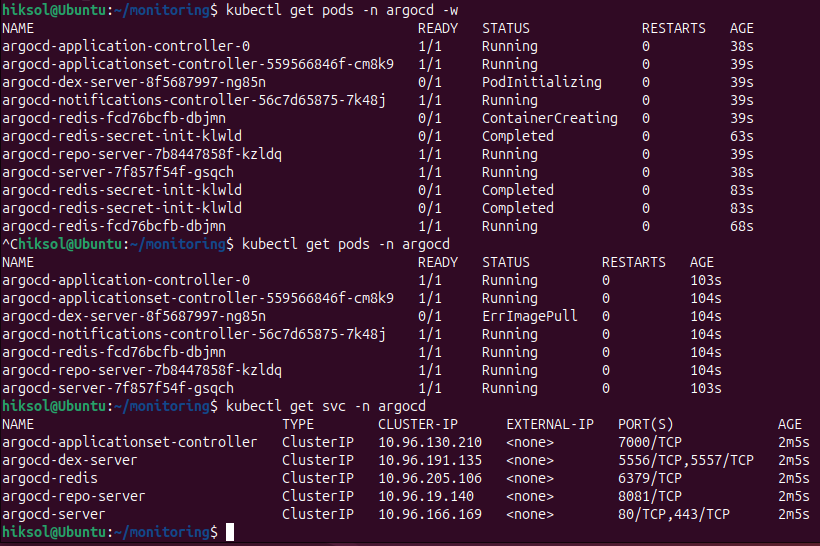
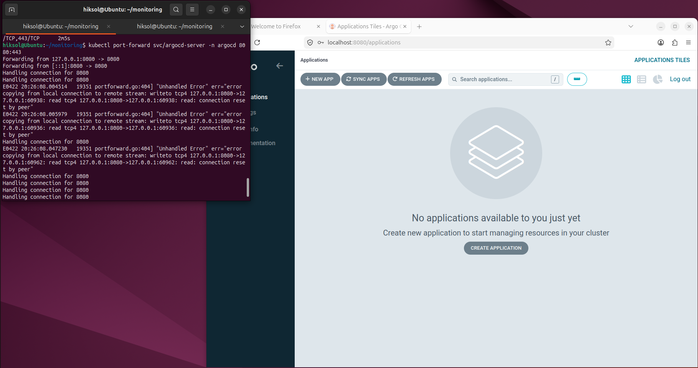
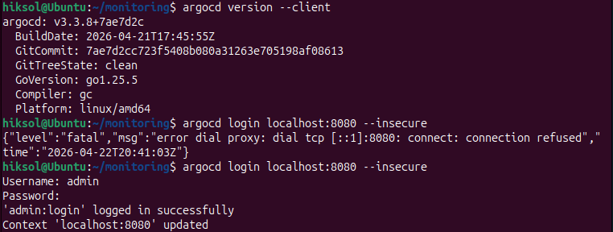
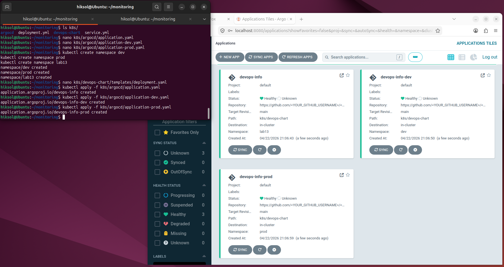

# Lab 13 — GitOps with ArgoCD

## 1. ArgoCD Setup

ArgoCD was successfully installed in the Kubernetes cluster using Helm.

### Installation

The following steps were performed:

```bash
helm repo add argo https://argoproj.github.io/argo-helm
helm repo update

kubectl create namespace argocd

helm install argocd argo/argo-cd -n argocd
```

After installation, all ArgoCD components were verified:

```bash
kubectl get pods -n argocd
```

All pods (argocd-server, argocd-repo-server, argocd-application-controller, etc.) were in **Running** state.

### UI Access

Access to the ArgoCD UI was configured via port-forwarding:

```bash
kubectl port-forward svc/argocd-server -n argocd 8080:443
```

The initial admin password was retrieved:

```bash
kubectl -n argocd get secret argocd-initial-admin-secret \
-o jsonpath="{.data.password}" | base64 -d
```

Login credentials:

* Username: `admin`
* Password: retrieved from secret

The UI was successfully accessed at:

```
https://localhost:8080
```

### CLI Setup

ArgoCD CLI was installed and configured:

```bash
argocd login localhost:8080 --insecure
```

Connection was verified:

```bash
argocd app list
```

---

## 2. Application Deployment

### Application Manifest

A declarative ArgoCD Application was created in:

```
k8s/argocd/application.yaml
```

It points to the Git repository containing the Helm chart:

* **Source:** Git repository with Helm chart (`k8s/devops-chart`)
* **Target revision:** main branch
* **Destination:** Kubernetes cluster (`default` namespace)

### Deployment

Application was applied:

```bash
kubectl apply -f k8s/argocd/application.yaml
```

After applying:

* Application appeared in ArgoCD UI
* Initial status: **OutOfSync**

### Sync

Manual sync was triggered:

```bash
argocd app sync devops-info
```

Result:

* Status changed to **Synced**
* Health status: **Healthy**
* All Kubernetes resources (Deployment, Service, ConfigMap, PVC, Secret) were created successfully

### Verification

Application was accessible via port-forward:

```bash
kubectl port-forward svc/devops-info-service 5000:80
```

Test request:

```bash
curl http://localhost:5000/
```

Result:

* Service returned valid JSON response
* Visit counter increased with each request
* Configuration and environment variables were correctly loaded

### GitOps Workflow Test

A change was made in the Helm chart (e.g., replica count).

After committing and pushing:

* ArgoCD detected drift
* Application status changed to **OutOfSync**

After manual sync:

* Changes were applied
* Status returned to **Synced**

---

## 3. Multi-Environment Deployment

### Namespaces

Two separate environments were created:

```bash
kubectl create namespace dev
kubectl create namespace prod
```

### Applications

Two ArgoCD Applications were created:

#### Dev Environment

* Namespace: `dev`
* Values file: `values-dev.yaml`
* Sync policy: **Automatic**

#### Prod Environment

* Namespace: `prod`
* Values file: `values-prod.yaml`
* Sync policy: **Manual**

### Auto-Sync (Dev)

Dev configuration included:

```yaml
syncPolicy:
  automated:
    prune: true
    selfHeal: true
```

This enabled:

* Automatic deployment after Git changes
* Automatic rollback of manual cluster changes

### Manual Sync (Prod)

Production environment required manual sync:

* Ensures controlled deployments
* Prevents accidental changes
* Allows validation before release

### Verification

```bash
kubectl get pods -n dev
kubectl get pods -n prod
```

Result:

* Both environments had running pods
* Configurations differed (replicas, resources)
* Applications visible in ArgoCD UI

---

## 4. Self-Healing & Sync Behavior

### Test 1 — Manual Scaling (ArgoCD Self-Healing)

Manual scaling was performed:

```bash
kubectl scale deployment devops-info -n dev --replicas=5
```

Observed behavior:

* ArgoCD detected drift (OutOfSync)
* Automatically reverted replicas to Git-defined value
* Status returned to **Synced**

### Test 2 — Pod Deletion (Kubernetes Self-Healing)

Pod was deleted:

```bash
kubectl delete pod -n dev -l app=devops-info
```

Observed behavior:

* Kubernetes automatically recreated the pod
* No involvement from ArgoCD
* Deployment remained healthy

### Test 3 — Configuration Drift

Manual change (e.g., label modification) was applied via kubectl.

Observed behavior:

* ArgoCD detected configuration drift
* Automatically reverted changes (self-heal)
* Cluster state restored to match Git

---

## 5. Sync Behavior Explanation

### ArgoCD

* Ensures cluster matches Git
* Detects drift every ~3 minutes (default)
* Can auto-sync changes (dev environment)
* Reverts manual changes (self-heal)

### Kubernetes

* Ensures desired runtime state (pods running)
* Recreates deleted pods automatically
* Does NOT compare against Git

### Key Difference

| Feature                | Kubernetes | ArgoCD |
| ---------------------- | ---------- | ------ |
| Pod recreation         | ✅          | ❌      |
| Config drift detection | ❌          | ✅      |
| Git as source of truth | ❌          | ✅      |
| Auto rollback          | ❌          | ✅      |

---

## 6. Results

The GitOps workflow was successfully implemented:

* ArgoCD fully deployed and operational
* Application managed declaratively via Git
* Multi-environment setup (dev/prod) working correctly
* Automatic sync enabled for development
* Manual control preserved for production
* Self-healing behavior verified

### Key Observations

* Application state is fully controlled by Git
* Manual changes in cluster are temporary
* Dev environment updates instantly after Git changes
* Production requires explicit sync for safety
* Persistent storage (visits counter) remains intact across restarts

---

## 6. Evidence







